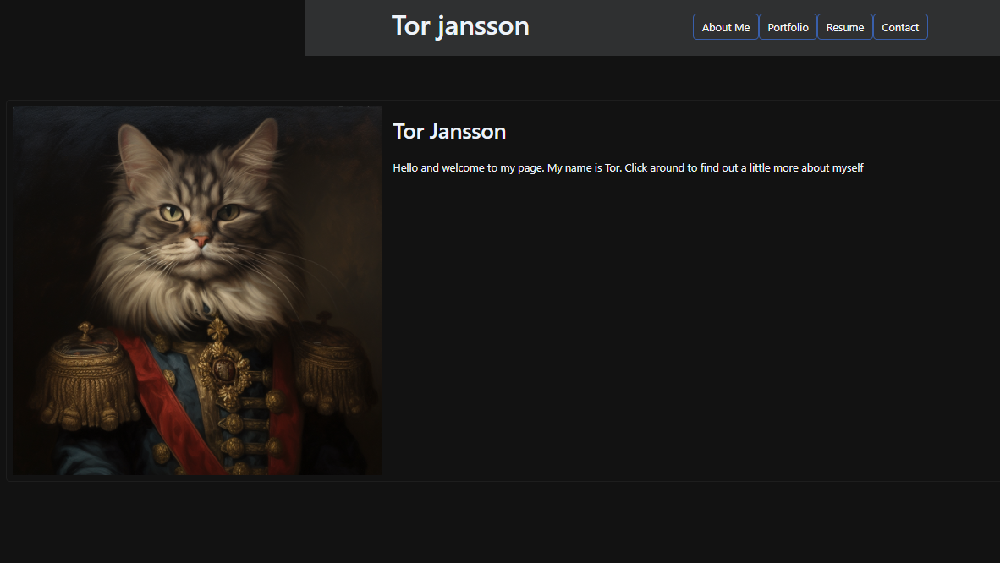

# React Portfolio

## Description
The purpose of this application is to showcase projects in a React framework

The deployed link can be found [here](https://tor-react-portfolio.netlify.app)

The repo is found here on the [Github Repo Page](https://github.com/tjansson-ui/ReactPortfolio)
  ## Table of Contents
  * [Installation](#installation)
  * [License](#license)
  * [Contributions](#contributions)
  * [Questions](#questions)

## [Installation](#Table-of-Contents)
1. Install 'node.js' https://nodejs.org/en/download, if not installed already.

2. Clone this repo to your local computer https://github.com/tjansson-ui/ReactPortfolio

3. Install dependencies by typing `npm install` in the terminal's command line.

4. run `npm run dev`

## [License](#table-of-contents)
[MIT License](https://opensource.org/licenses/MIT)

## [Contributions](#table-of-contents)
This application was initiated as a project from the University of Wisconsin Coding Bootcamp. The project was designed and completed by Tor Jansson.

## [Questions](#Table-of-Contents)
If you have any questions contact developers here:

T. Jansson: [Github](https://github.com/tjansson-ui)
